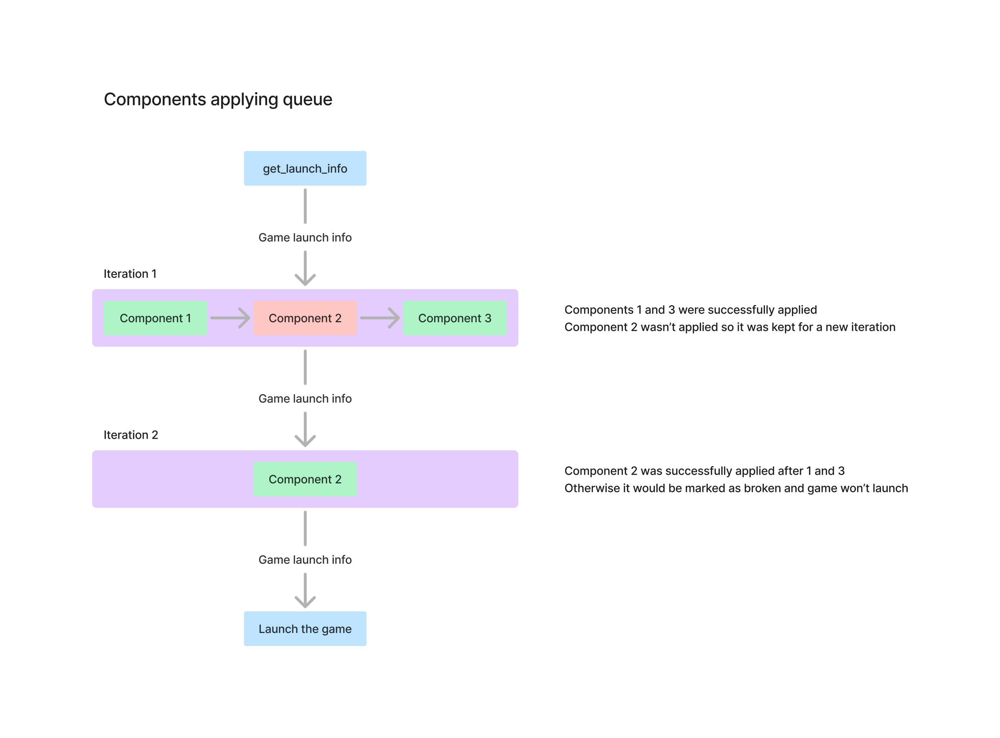

# v1 standard of the components integrations

Game integration is a specially encoded lua table containing
set of pre-defined functions which could be used by the launcher
to display information about the game and perform actions with it.

Game integrations are provided by the top-level packages (modules).
If a package depends on another game integration - it will not be
used in the launcher.

## Components variant integration format

Top-level modules are expected to return the components integration object:

```ts
type ComponentsIntegration = {
    standard: 1,

    // Get list of groups for the components variant
    // which are compatible with given source and target platforms
    // of a current profile.
    groups: (source_platform: TargetPlatform, target_platform: TargetPlatform): ComponentsGroup[],

    // Get list of components for a group.
    // It is expected that you encode source and target platforms
    // supported by the group into its name.
    components: (group: string): Component[],

    component: {
        // Get status of the component installation.
        get_status: (component: string): InstallationStatus,

        // Get installation diff. If no diff
        // available (not required) - return nil.
        get_diff: (component: string): InstallationDiff | null,

        // Update params used to launch the game.
        // Return null if component can't be applied to the launch info.
        // In this case it will be applied later, on the next iteration.
        apply: (component: string, launch_info: GameLaunchInfo): GameLaunchInfo | null
    },

    // Optional list of settings for the components variant.
    settings?: DynamicSettings
};

type ComponentsGroup = {
    // Unique name of the group.
    name: string,

    // Title of the group displayed in UI.
    title: Localizable,

    // Description of the group displayed in UI.
    description?: Localizable
};

type Component = {
    // Unique name of the component.
    name: string,

    // Title of the component displayed in UI.
    title: Localizable,

    // Description of the component displayed in UI.
    description?: Localizable
};
```

> Some types are defined in the games integration standard.

Apply method should return updated game launch info if component was
successfully applied, or `null` if it couldn't be applied yet (out of order).
In this case all the components which returned `null` will be put into
a new queue and attempted to be applied again. This will continue until
all the components will be applied or none of them was applied from the
current queue.


