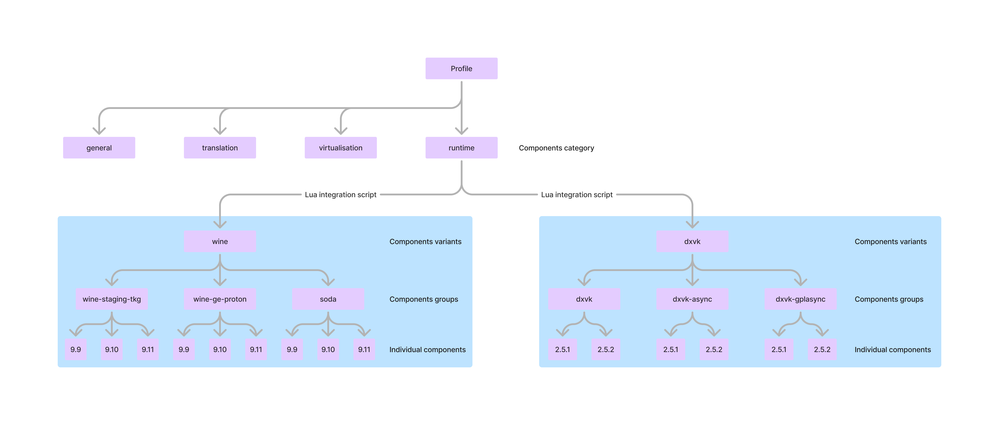

# v1 standard of the components manifests

Components are meant to transform profiles by installing
additional binaries and libraries, tweaking their settings,
adding new environment variables, changing game launch command,
and so on.

Components are united into groups, variants and categories.
You can research the hierarchy on the chart below.



Components within the same group are meant to display different available
versions of the same project. For example, different wine or DXVK versions.
You can select only one component from the same group.

Groups are united to variants. They're meant to display different
editions of the same project (e.g. community-made forks).
For example, different wine editions.
You can select only one group from the same variant.

Variants are distributed in form of lua integration scripts, similarly to the
games' integration scripts. This allows them to dynamically update lists
of available components by fetching the info from remote sources.
This also allows developers to provide their own functionality for
components, implementing specific installation algorithms.

## Components variant manifest format

```ts
type Manifest = {
    standard: 1,

    variant: {
        // Unique name of the components variant.
        // Example: `wine`.
        name: string,

        // Title of the components variant displayed in UI.
        title: Localizable,

        // Description of components variant displayed in UI.
        description: Localizable,

        // Category of the components variant specifies the settings page
        // on which the components are displayed, and the order in
        // which they are applied to the profile. They don't have
        // any other differences.
        category: Category
    },

    package: {
        // URL to the component integration package.
        url: string,

        // Name of the output lua module containing the component's integration code.
        output: string,

        // Information about the profile (runtime) for which components
        // in this variant are made.
        runtime: {
            // Supported source platforms of the profile.
            // In most cases it's `x86_64-linux-native`.
            source_platforms: TargetPlatform[],

            // Supported target platforms of the profile.
            // In most cases it's `x86_64-linux-wine64`.
            target_platforms: TargetPlatform[]
        }
    }
};

type Category =
    | 'translation'
    | 'virtualisation'
    | 'runtime'
    | 'general';
```

## Components registry

Components registry is a standard way of storing collections
of the component variants' manifests. Launcher fetches all the manifests
listed in the registry and displays them in profiles settings.

```ts
type Manifest = {
    format: 1,

    // Title of the registry.
    title: Localizable,

    // List of URLs for components' variants for each category.
    components: {
        [category: Category]: string[]
    }
};
```
